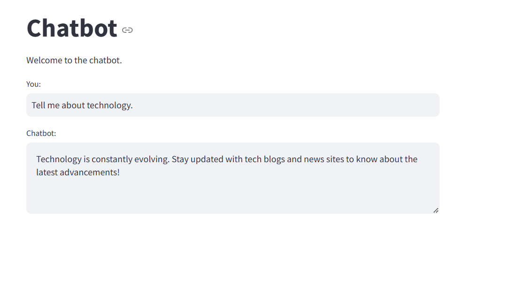

# Implementation of Chatbot Using NLP

## Overview
Advancements in Artificial Intelligence (AI) and Natural Language Processing (NLP) have made chatbots an important tool for interacting with computers in a human-like way. This project focuses on building a smart chatbot that uses NLP to improve user experiences in areas like customer service, education, healthcare, and online shopping.
The chatbot works by understanding and responding to user messages in natural language. It uses processes like cleaning and preparing text, identifying the user’s intent, and picking out important details like names or dates. It keeps track of the conversation and creates meaningful replies, either by selecting the best answer from a database or generating new responses.

---

## Features
- Understands various user intents such as greetings, farewells, gratitude, and more.
- Provides relevant responses based on user input.
- Maintains a conversation history that can be viewed by the user.
- Built using Python and leverages popular libraries for NLP and machine learning.

---

## Technologies Used
- **Python**
- **NLTK**
- **Scikit-learn**
- **Streamlit**
- **JSON** for intents data

---

## Intents Data
The chatbot's behavior is defined by the `intents.json` file, which contains various tags, patterns, and responses. You can modify this file to add new intents or change existing ones.

---

## Acknowledgments
- **NLTK** for natural language processing.
- **Scikit-learn** for machine learning algorithms.
- **Streamlit** for building the web interface.
